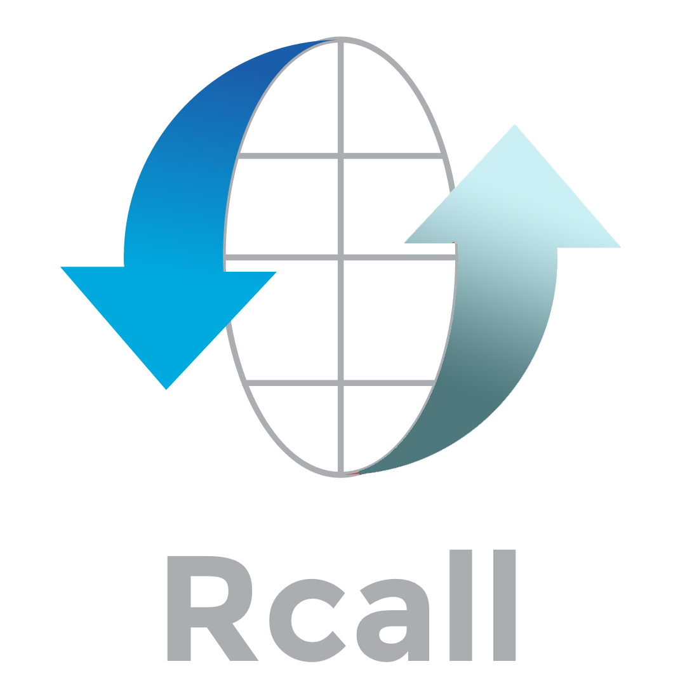
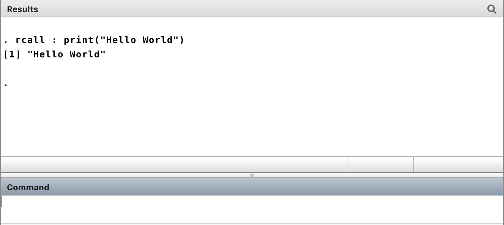
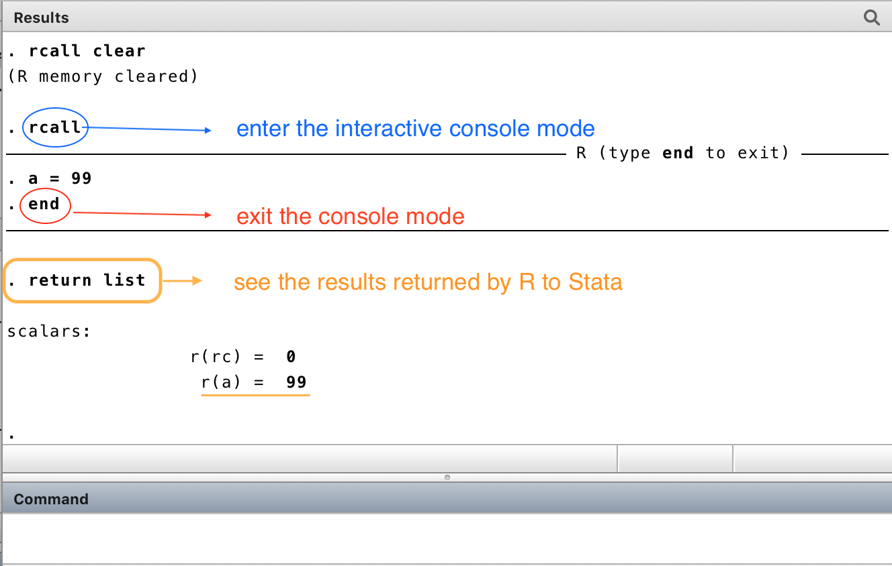
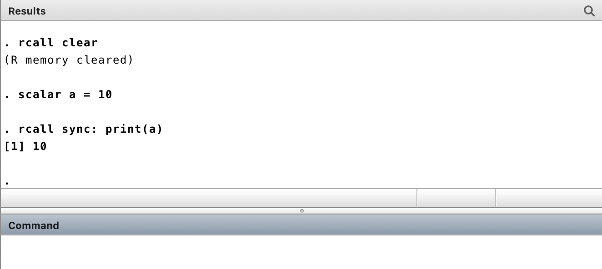

> __Cite__: Haghish, E. F. (2019). Seamless interactive language interfacing between R and Stata. The Stata Journal, 19(1), 61-82.

---

#### WARNING

`rcall 3.0.0 BETA` is under development. If you like to help testing the new development, install the development vesion

```js
github install haghish/rcall
```

Otherwise, install the latest stable release

```js
github install haghish/rcall, stable
```

# rcall : seamless R in Stata

<a href="http://haghish.com/markdoc"></a>

__`rcall`__ runs [__R__](https://cran.r-project.org/) commands in Stata, allowing the two software automatically communicate _variables_, 
_matrices_, and _data_. This is done based on a new interfacing paradigm that attempts to synchronize data between two distinct computer languages, particularly when coding is carried out interactively. For more information read the help file or 
[visit rcall homepage](http://www.haghish.com/packages/Rcall.php). 
__`rcall`__ simulates the R language inside Stata and returns _rclass_ scalars, macros, and matrices from R to Stata, anytime an [__R__](https://cran.r-project.org/) command is executed. 
Similarly, it allows passing _macro_, _matrix_, _scalar_, and _data frame_ from Stata to [__R__](https://cran.r-project.org/). As a result, Stata users can open an R window in the middle of a data analysis, execute the R commands, and continue the rest of the analysis with Stata, given the results of the R analysis already made available to Stata in the form of scalar, macro, matrix, or data frame.

__`rcall`__ makes it so easy to run [__R__](https://cran.r-project.org/) within Stata interactively, pass data or a matrix to R, 
and access the results (numeric, matrix, character, lists) automatically within Stata which simply brings the power of [__R__](https://cran.r-project.org/) as well as all other programming languages that can be used interactively in R (e.g. C++ using [Rcpp](http://rcpp.org/) or JavaScript using [V8](https://cran.r-project.org/web/packages/V8/index.html)) in Stata. 

The `rcall` package is **much more than calling R within Stata**! It implements a veriety of procedures for quality check and making sure that the R code can proprly gets executed within Stata and it also provides functions to allow Stata programmers evaluate the satisfactory versions of R and R packages in their programs. Moreover, it **automatically returns the results of the analysis from R into Stata, in an accessible formats such as matrices, scalars, data sets, etc**. Here is a quick and dirty diagram, showing the huge potential of `rcall` to enhance your Stata:


# 1. Installation


The [__`github package`__](https://github.com/haghish/github) is the only recommended way for installing **`rcall`**. Once [__`github`__](https://github.com/haghish/github) is installed, type:

```js
github install haghish/rcall, stable
```

# 2. rcall modes of data communication

Language interfacing is done for a veriety of purposes. For example, you may call R within Stata to:

- perform a particular analysis on your data 
- develop a Stata program that relies on some functionalities provided in R or its add-on packages

Both require data communication back and forth between Stata and R and this is where `rcall` stands out. `rcall` excells in a few modes to facilitates data communication based on your needs. These modes are summarized in the graph below:


In general, it offers 2 modes of data communication which are 

1. **interactive**, often used for data analysis when the user might call R frequently and interactively. This general mode includes a memory that preserves the history of your R session. This mode itself can be used in three ways:
     1. *interactive*, where the R session can be continued command by command. **this mode allows you call R interactively within Stata do-files**
     2. *console*, where Stata console is converted to R console. this mode allows you to work with R interactively within Stata, but cannot be called from do-files. However, it provides a much more fun experience, namely to have R console within Stata console!
     3. *`sync`*, which is an **experimental mode**, where all objects (except data frames because they might be heavy) are synced between Stata and R and changing any object in any of the environment (Stata or R) will alter the other one. In other words, when you are using the `sync` mode, whatever you do in R will automatically get pushed back into Stata! 

2. **non-interactive**, which is the recommended mode for integrating R into Stata programs. This mode does not have a memory and every call will begin a fresh R session

# 3. Examples

`rcall` is very powerful, yeat very easy to work with. In the following examples, I simply use R to define a scalar or print a text, just to show you how easy it is to use `rcall` and to get data back into Stata. But to stand by the traditions, I start with a *Hello World* example with **interactive mode**

_interactive mode: calling R to print a text_



We can also open the R console within Stata to have fun with R without exiting Stata! You notice that working with R interactively in the console mode **is even easier than working with MATA within Stata** because `rcall` automatically returns the data from R to Stata. 

_interactive console mode: defining object `a = 99` in R and getting it back in Stata_



Type `return list` to see what objects have ben transfered from R to Stata. This is one of the biggest advantages of `rcall`, namely, the objects you define in R can be automatically accessed within Stata! Of course, you can control what objects to return (especially if you are programming a Stata ado-program that embeds R). Read the manuscript published by Stata Journal for details. 

_interactive sync mode: object `a` is automatically transported into R and you do not need to define it_



Resources
---------

<a href="https://github.com/haghish/rcall/tree/master/examples">Examples</a>

<a href="https://github.com/haghish/rcall/releases">Release notes</a>

<a href="http://www.statalist.org">Need help? Ask your questions on statalist.org</a>

Author
------
  **E. F. Haghish**  
  Center for Medical Biometry and Medical Informatics    
  University of Freiburg, Germany        
  _haghish@imbi.uni-freiburg.de_       
  _http://www.haghish.com/packages/Rcall.php_      
  _[@Haghish](https://twitter.com/Haghish)_      
  


